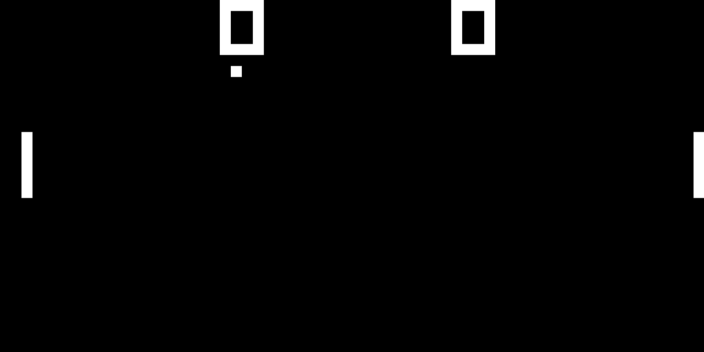

chip8-rs
========

Yet another chip8 emulator written in rust \o/

If you encounter any problems, I encourage you to open a PR!

## Games
Due to legal reasons, I can't provide any games nor links to them.
But they can be easily found by using a search engine!

## Installation/Dependencies
Install instructions can be found [here](INSTALL.md).

## TODO
[ ] Add Beeper Sound

## Credits
For this project I used the help from the following sites:
+ [Chip-8 Technical Reference](http://devernay.free.fr/hacks/chip8/C8TECH10.HTM#3.0)
+ [How to write an emulator (CHIP-8 interpreter)](http://www.multigesture.net/articles/how-to-write-an-emulator-chip-8-interpreter/)
